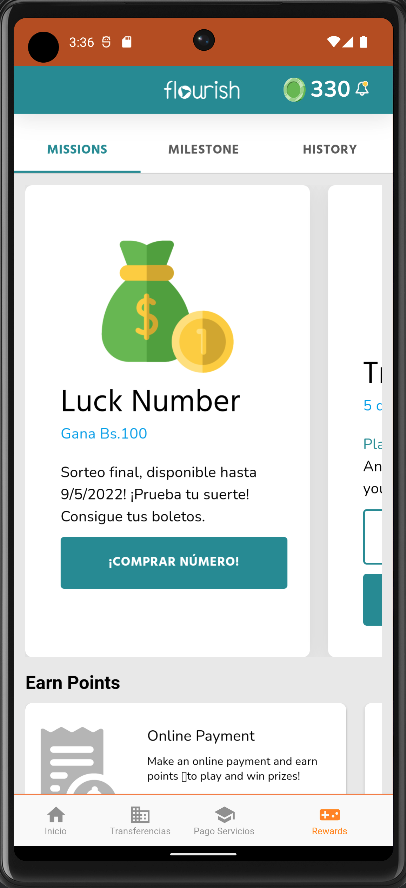
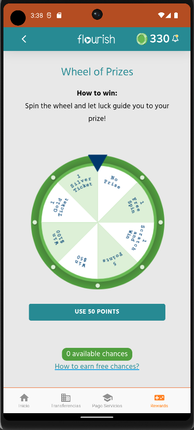
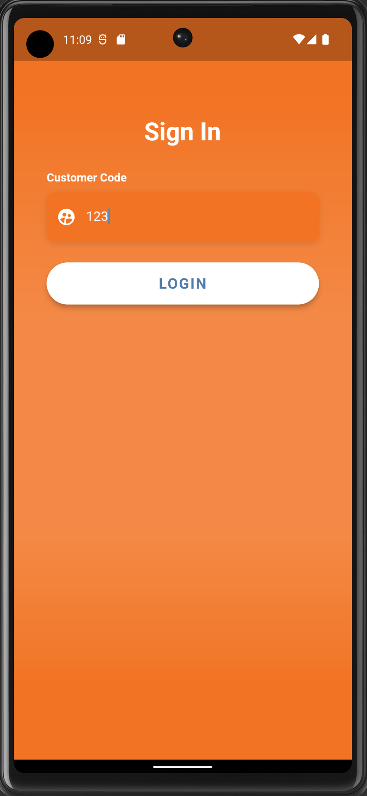
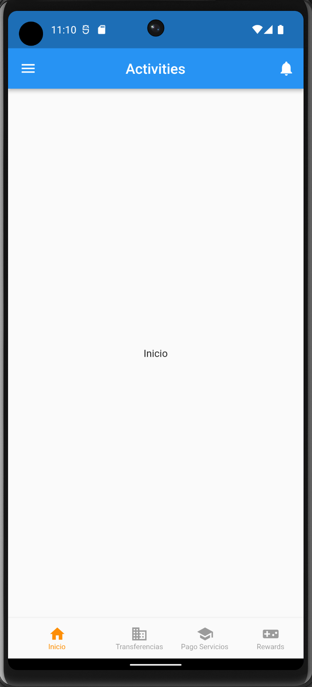

[](https://flourishfi.com)
<br>
<br>
# Flourish SDK Flutter

This flutter plugin will allow the communication between the visual implementation of Flourish functionality.
<br>
<br>

Table of contents
=================

<!--ts-->
   * [Installation](#installation)
      * [Requirements](#requirements)
      * [Configuration](#configuration)
   * [Getting Started](#getting-started)
   * [Events](#events)
   * [Examples](#examples)
<!--te-->
<br>
<br>

## Installation

### Requirements
___
* Flutter
* Dart
<br>
<br>

### Configuration
___

Add the plugin as a dependency in your file pubsec.yaml as follows:

```
 flourish_flutter_sdk:
    git:
      url: git@github.com:Flourish-savings/flourish-sdk-flutter.git
      ref: 1.0.0
```
<br>
<br>

## Getting Started
___
To use this plugin, you will need these elements:

- partnerId: a unique identifier that will be provided by Flourish
- secret: a string that represents a key, also provided by Flourish

This plugin can be run in two different environments:

- staging: In this environment, you can test the functionality without impacting any real data
- production: this environment is for running the app with the real data
<br>
<br>

### Initializing the SDK
___

In the main file of your application, you need to call the method initilize providing the partnerId and the secret.

```
  Flourish flourish = Flourish.initialize(
    partnerId: <HERE YOU'll USE YOUR PARTNER ID>,
    secret: <HERE YOU'll USE YOUR SECRET>,
    env: Environment.staging,
    language: Language.english,
  );

```
### Authentication with the customerCode
___

`customerCode` is the element that identifies the final user, the person who is the client. Regarding what this element is called in your system you need to pass this information to the plugin via the authenticate method.

```
  flourish.authenticate(customerCode: '123').then((value) {
    // apply other logic here
  });
```

### Displaying the webview

All the functionality of Flourish is displayed via a webview, you can initialize this webview using this:

```
  flourish.home()
```

After a successful rendering, you should see something like this.


<br>
<br>

<br>
<br>

## EVENTS
___

You can also register for some events to know when something happens within our platform.

You can listen to a specific already mapped event, an unmapped event, or all events if you prefer.

### Listen our mapped events

We have some events already mapped that you can listen to separately

For example, if you need know when ou Trivia feature finished, you can listen to the "TriviaFinishedEvent"

```
flourish.onTriviaFinishedEvent((TriviaFinishedEvent response) {
  print("Event name: ${response.name}");
  print("Event data: ${jsonEncode(response.data.toJson())}");
});
```
you can find our all mapped events here:
https://github.com/Flourish-savings/flourish-sdk-flutter/tree/main/lib/events/types

### Listen our unmapped events
Even if our platform starts sending new unmapped events, it will not be necessary to update the SDK version to consume them.

Just start listening to the generic events

```
flourish.onGenericEvent((GenericEvent response) {
  print("Event name: ${response.name}");
  print("Event data: ${jsonEncode(response.data.toJson())}");
});
```

### Listen all events
But if you want to listen all the events, we also have that for you.

```
flourish.onAllEvent((Event response) {
  print("Event name: ${response.name}");
});
```

## Examples
Inside this repository, you have an example app to show how to integrate with us:

https://github.com/Flourish-savings/flourish-sdk-flutter/tree/main/
<br>

This will simulate your Flutter App calling our application inside a Flutter web-view component
<br>
<br>

<br>
<br>

<br>
<br>
